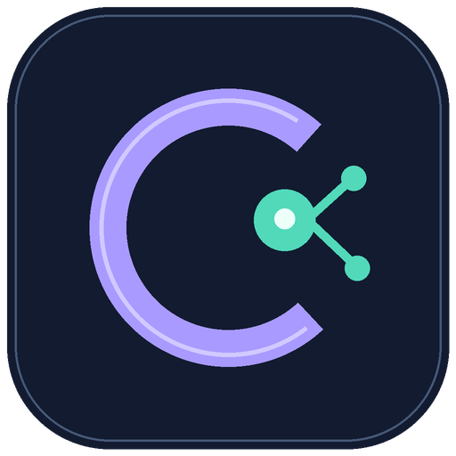
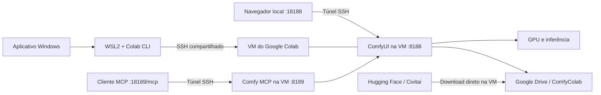

<div align="center">



# Easy Comfy Colab

**Seu editor no notebook. A GPU no Google Colab. Seus arquivos no Drive.**

[Instalação](#instalação) · [Como usar](#como-usar) · [Arquitetura](docs/ARCHITECTURE.md) · [Problemas comuns](docs/TROUBLESHOOTING.md) · [Contribuir](CONTRIBUTING.md)


[](https://github.com/AnthonyVeras/easy-comfy-colab/actions/workflows/checks.yml)

</div>

Easy Comfy Colab é um aplicativo Windows para iniciar e gerenciar o **ComfyUI em uma VM do Google Colab**, com interface acessível pelo navegador do seu computador e arquivos persistentes no Google Drive. Foi criado para quem quer trabalhar com ComfyUI sem depender da GPU do próprio notebook.

A instalação remota aproveita o [ComfyUI-Easy-Install](https://github.com/Tavris1/ComfyUI-Easy-Install). O acesso à VM usa o [Colab CLI oficial](https://github.com/googlecolab/google-colab-cli), executado dentro do WSL2, porque o CLI não oferece suporte nativo a Windows.

> **Versão 2.0.6, experimental.** A edição pública mantém isolamento de credenciais e caminhos configuráveis. Restauração de imagem foi usada na instalação de referência; instalação completa em outros computadores e transferência real entre duas contas ainda precisam de validação pela comunidade. Consulte a [matriz de validação](docs/VALIDATION.md).

## O que ele faz

| Área | Recursos |
| --- | --- |
| Sessão | Iniciar/encerrar VM, reconectar, abrir ComfyUI e reiniciar apenas o servidor |
| Inicialização | Restaurar instalação pronta do Drive, atualizar a imagem manualmente ou antes de desligar |
| Resultados | Escolher Drive ou PC; cópia automática e verificação antes de desligar no modo PC |
| Hardware | Seleção de G4, A100, L4, T4 ou CPU para downloads; leitura da GPU efetivamente recebida |
| Modelos | URLs Hugging Face/Civitai, categorias, fila, 1–6 downloads paralelos, cancelamento e retomada |
| Carregamento | Cache no disco da VM, seleção por workflow e pré-leitura opcional na RAM |
| Contas e Drive | Perfis separados, cópia de pasta entre contas e biblioteca de modelos compartilhada |
| Monitor | CPU/RAM do notebook e VM, memória do aplicativo, GPU/VRAM, temperatura e disco temporário |
| Workflows | Inspeção de JSON para apontar modelos e custom nodes ausentes, incluindo subgrafos |
| Créditos | Saldo, CU/h da conta, autonomia estimada, aviso de saldo e histórico observado |
| Economia | Encerramento opcional por inatividade, com verificação da fila e dos downloads |
| Integrações | Servidor Comfy MCP na VM, disponível por túnel local |

## Idioma / Language

Em **Configurações → Idioma / Language**, escolha **Português (Brasil)** ou **English**. A escolha é salva neste computador e aplicada imediatamente, sem reiniciar o ComfyUI ou a VM.

Go to **Settings → Language / Idioma** to switch between **English** and **Português (Brasil)**. The app remembers your choice on this computer. Forms and the active session are preserved.

A tradução cobre a interface, os avisos e as confirmações do aplicativo. Logs técnicos recebidos do Colab, instaladores e custom nodes permanecem no idioma original. O idioma do editor ComfyUI é configurado separadamente nele.

## Como funciona



O navegador local é uma janela para o servidor remoto. **Os pesos e a inferência não são carregados na GPU do notebook.** Não é uma extensão da RAM do Windows: os processos de geração rodam no Linux do Colab.

Na primeira preparação de uma VM GPU, o instalador também baixa o pequeno upscaler RealESRGAN para o Drive e executa uma verificação de inferência. Esse passo usa a GPU alocada. Os modelos para seus workflows são adicionados separadamente.

## Requisitos

- Windows 10/11 com **WSL2** e Ubuntu. Referência de desenvolvimento: Windows 11 e Ubuntu 24.04.
- Conta Google com acesso ao Colab e recursos suficientes para o hardware solicitado. Nenhuma assinatura ou crédito está incluído no aplicativo.
- Espaço no Google Drive para seus modelos, entradas, resultados e cache.
- Conexão com a internet; `localhost` compartilhado entre Windows e WSL.
- Para executar/compilar o código-fonte: **Python 3.11+ para Windows**, com Tkinter e Python no PATH. A compilação de referência usa Python 3.14.
- Para o pacote `.exe`: Python Windows não é necessário; a preparação do WSL continua obrigatória.

A GPU escolhida é uma solicitação ao Colab. Disponibilidade, memória, preços em unidades computacionais e duração da sessão são definidos pelo serviço; não há promessa de uma GPU ou taxa fixa.

## Instalação

### 1. Preparar o WSL

Se ainda não tiver Ubuntu no WSL2, execute em PowerShell como administrador:

```powershell
wsl --install -d Ubuntu-24.04
```

Reinicie se solicitado, abra o Ubuntu e conclua a criação do usuário Linux. Depois siga em um PowerShell normal. Consulte também a [documentação oficial do WSL](https://learn.microsoft.com/windows/wsl/install).

### 2. Escolher executável ou código-fonte

#### Pacote Windows

1. Baixe o ZIP em [Releases](https://github.com/AnthonyVeras/easy-comfy-colab/releases).
2. Confira o SHA-256 publicado e extraia **a pasta inteira** para um local permanente.
3. Na raiz da pasta extraída, execute:

```powershell
.\Setup.ps1 -SkipWindowsDependencies
.\Launch.ps1
.\Create-Shortcut.ps1
```

O executável fica em `Easy Comfy Colab/Easy Comfy Colab.exe`. Não mova somente o `.exe`: ele precisa de `_internal`, dos scripts e dos recursos presentes no pacote.

Se a política de execução da sua máquina bloquear scripts, siga a política do seu ambiente e revise os arquivos antes de autorizá-los. O projeto não altera a política do Windows automaticamente.

#### Código-fonte

```powershell
git clone https://github.com/AnthonyVeras/easy-comfy-colab.git
cd easy-comfy-colab
.\Setup.ps1
.\Launch.ps1
```

`Setup.ps1` cria `.venv` no Windows, prepara um ambiente separado do Colab CLI no WSL, gera uma chave SSH própria e salva a configuração desta máquina fora do repositório. O passo Linux instala dependências via `sudo` e pode solicitar a senha do usuário Linux. Ele não abre uma VM nem conecta sua conta Google.

Para outro nome de distribuição ou usuário:

```powershell
.\Setup.ps1 -Distro Ubuntu -WslUser seu_usuario_linux
```

Também são aceitas as variáveis `EASY_COMFY_WSL_DISTRO` e `EASY_COMFY_WSL_USER`. O usuário padrão da distribuição é usado quando nenhum usuário é informado.

### 3. Conectar uma conta

Abra o aplicativo, clique **Conectar conta**, conclua o fluxo oficial do Google e envie o código solicitado. Ao iniciar uma VM, a montagem do Drive pode pedir outra autorização. Leia as permissões apresentadas pelo Google e confira a conta selecionada.

O aplicativo é distribuído **sem contas, tokens, chaves privadas, modelos ou conteúdo de usuários**. Cada pessoa autoriza sua própria conta. Credenciais de uma instalação anterior do Comfy Colab não são importadas automaticamente.

## Como usar

### Iniciar e encerrar

1. Selecione a conta no topo e escolha G4, A100, L4 ou T4 na aba **Sessão**.
2. Clique **Iniciar sessão**. A atividade mostra alocação, montagem do Drive, instalação e início dos serviços.
3. Clique **Abrir ComfyUI** ou use `http://127.0.0.1:18188/`.
4. Ao terminar, clique **Encerrar VM**. O app atualiza e verifica a imagem, salva os outputs e então libera os recursos. Se o salvamento falhar, mantém a VM ligada e informa o erro.

**Reiniciar ComfyUI** reinicia só o servidor e libera os modelos da memória, preservando a VM. **Liberar VRAM** descarrega os modelos com a fila vazia. **Reconectar** tenta recuperar o acesso a uma sessão existente.

Fechar o navegador não encerra a VM. Ao fechar o aplicativo com uma sessão ativa, escolha se deseja encerrá-la ou mantê-la. Uma sessão mantida pode continuar consumindo créditos. A automação de inatividade exige que o aplicativo permaneça aberto.

### Inicialização por imagem do Drive (2.0.5)

A primeira VM instala o ambiente e prepara uma **imagem privada** em `Meu Drive/ComfyColab/.runtime-images/`. Nas próximas VMs compatíveis, o app copia esse arquivo para o disco local, verifica sua integridade, extrai e usa a instalação pronta. O software roda no disco da VM. Não é necessário Docker.

Na aba **Sessão**, **Atualizar imagem do Drive** captura novos nodes e dependências sem reiniciar o servidor. O encerramento da VM faz a mesma atualização automaticamente. A gravação pode acrescentar alguns minutos ao encerramento, durante os quais a GPU continua alocada. A imagem anterior só deixa de ser selecionada depois de a nova ser verificada; arquivos de imagens antigas não são apagados automaticamente.

**O ZIP público não contém uma imagem pré-configurada nem modelos.** Cada usuário gera sua própria imagem. Mudanças na base Python/PyTorch do Colab podem exigir uma instalação completa. Na instalação de referência, o usuário reportou **4 minutos**, ante aproximadamente 17 minutos; não há garantia desse tempo em outras sessões. Saiba mais em [imagem e recuperação](docs/RUNTIME_IMAGE.md).

### Salvar resultados no PC ou no Drive

Na aba **Sessão → Onde salvar os resultados**, escolha **Google Drive** ou **Meu PC**. A preferência é salva por conta. Para uma sessão já aberta, a escolha só entra em vigor ao clicar **Reiniciar ComfyUI**: a VM e sua GPU permanecem alocadas; o servidor reinicia e recarrega os modelos quando necessário. Selecionar a opção não reinicia nada automaticamente.

- **Drive:** o ComfyUI grava em `Meu Drive/ComfyColab/output`.
- **PC:** o ComfyUI grava primeiro no disco temporário da VM, fora do Drive. Com o aplicativo aberto, uma cópia automática é tentada a cada 15 segundos quando a fila está vazia. Arquivos vão para `%USERPROFILE%/Comfy Colab Results/output/<identificador-da-VM>/`; essa separação evita sobrescrever resultados de VMs anteriores.
- **Abrir outputs no PC** abre a pasta local. A pasta `input` fica ao lado; seus arquivos são enviados ao iniciar/reconectar.
- Contas adicionais usam `Comfy Colab Results/accounts/<perfil>/input` e `output`. Arquivos antigos nas pastas do aplicativo não são movidos ou apagados.
- Antes de encerrar uma VM com outputs temporários, o aplicativo exige fila vazia, pausa o ComfyUI e verifica a cópia final com checksum. Se a cópia falhar, mantém a VM ligada e tenta retomar o servidor. A VM pode continuar consumindo créditos até uma nova tentativa de encerramento.

**Esta opção controla apenas a pasta padrão de resultados.** Entradas, workflows e configurações continuam no Drive; nodes que gravam em caminhos próprios podem ignorar a pasta padrão. Arquivos anteriores no Drive permanecem lá. Fechar o app interrompe as cópias automáticas, e encerrar a VM pelo site do Colab ou perder o runtime pode eliminar resultados ainda não copiados. O modo PC não torna o processamento local: ele continua no Colab.

### Baixar modelos e LoRAs por URL

Cadastre seu token de leitura do Hugging Face ou chave do Civitai em **Configurações**. Depois, na aba **Modelos**, cole um link de arquivo por linha, escolha a categoria e clique **Adicionar à fila**.

```text
https://huggingface.co/ORGANIZACAO/REPOSITORIO/resolve/main/modelo.gguf
https://civitai.com/api/download/models/ID_DA_VERSAO | minha-lora.safetensors
```

Os links acima mostram o formato; não são modelos reais. No Hugging Face, links `/blob/` também são convertidos. No Civitai, informe o nome desejado após `|`. Uma página de apresentação do modelo não é o link de download da versão.

| Tipo | Categoria comum |
| --- | --- |
| LoRA | `loras` |
| Checkpoint | `checkpoints` |
| Modelo de difusão | `diffusion_models` ou a categoria exigida pelo loader |
| VAE | `vae` |
| Encoder de texto | `text_encoders` |
| ControlNet | `controlnet` |
| Upscaler | `upscale_models` |
| LLM GGUF | `llm_gguf` / `LLM`, conforme o custom node |

- Padrão: **3 downloads simultâneos**, ajustável de 1 a 6.
- Até 100 links por lote; um lote usa a mesma categoria.
- Extensões: `.safetensors`, `.sft`, `.ckpt`, `.pth`, `.pt`, `.gguf`, `.bin`, `.onnx`.
- A VM transfere os dados diretamente para `Meu Drive/ComfyColab/models/<categoria>`.
- O notebook envia o pedido; ele não baixa o modelo para depois enviá-lo ao Drive.
- **Cancelar** conserva o parcial; **Retomar** cria uma nova tentativa. Retomada por bytes depende de suporte HTTP Range e ETag na origem; sem isso, o arquivo recomeça.
- Arquivos completos existentes são preservados. Um arquivo de pesos não equivale à instalação de um repositório com tokenizadores e arquivos auxiliares.
- O botão **Baixar tudo** do ComfyUI usa a extensão de download remoto quando o workflow fornece URLs compatíveis. Modelos sem URL precisam ser adicionados manualmente.

Para baixar sem instalar/iniciar ComfyUI, selecione **CPU · Downloads** antes de iniciar. Depois encerre essa VM e inicie outra com GPU. O modo CPU permanece sujeito aos limites do Colab.

### Cache de modelos e pré-leitura na RAM

Em **Modelos → Carregamento rápido**, selecione arquivos na biblioteca com Ctrl ou use **Selecionar por workflow**, depois clique **Preparar selecionados**. Até dois arquivos são copiados em paralelo do Drive para o disco temporário da VM. Os originais continuam no Drive.

**Preparar antecipadamente na RAM** é opcional e vem desligado. Faz uma pré-leitura dos arquivos, respeitando o limite escolhido e uma reserva de memória. Usa o cache do Linux, que pode descartar páginas; não fixa os pesos na RAM nem os carrega antecipadamente na VRAM. A primeira cópia e a primeira geração continuam tendo custo. Os detalhes estão em [cache de modelos](docs/MODEL_CACHE.md).

### Trocar de conta ou copiar arquivos

Encerre a VM atual, abra **Contas e Drive** e adicione a outra conta. Os perfis têm autorizações separadas.

Para levar os arquivos, selecione a origem no topo, o destino no formulário e use **Verificar cópia** antes de **Copiar / retomar**. As duas contas precisam autorizar acesso ao Drive. O aplicativo concede leitura da pasta de origem ao destino e usa a API do Drive para copiar nos servidores do Google; os arquivos não passam pela internet doméstica.

O padrão é copiar **ComfyColab**, incluindo modelos, entradas, resultados e workflows. Também é possível informar o ID de outra pasta. Não é uma migração integral da conta Google: `.cache` é excluído, atalhos são recusados e propriedades/compartilhamentos não são migrados como um backup completo do Drive. Originais não são apagados. Cópias já verificadas são reaproveitadas; conflitos de nome preservam os dois arquivos.

**Compartilhar biblioteca** é uma alternativa: cria um atalho `models` no destino, com permissão de edição. As contas passam a modificar a mesma biblioteca, ainda pertencente à origem. O destino precisa estar sem uma pasta `models`. A resolução desse atalho pelo DriveFS ainda requer validação com contas reais.

### Monitoramento, créditos e economia

A aba **Monitor** separa o notebook da VM. Leituras de recursos são solicitadas a cada 5 segundos, e saldo/taxa a cada 30 segundos, sem bloquear a interface.

O Colab CLI informa **CU/h da conta**, que pode incluir outras sessões. A autonomia é `saldo ÷ taxa atual`. O histórico integra as taxas observadas e registra lacunas; não é uma fatura por GPU nem previsão garantida.

Em **Configurações**, ative um limite de inatividade se quiser. Ele vem desativado, depende de métricas recentes e suspende a contagem quando há geração, downloads, operações em andamento ou estado desconhecido. Um aviso final oferece 30 segundos para manter a sessão.

## O que fica salvo

| Local | Conteúdo | Sobrevive ao encerramento da VM? |
| --- | --- | --- |
| Google Drive: `ComfyColab/models` | Modelos e parciais | Sim |
| Google Drive: `ComfyColab/input`, `output`, `user` | Entradas, workflows, configurações e outputs no modo Drive | Sim |
| VM: `/content/comfy-colab/output-pc` | Outputs do modo PC antes de serem copiados | Não |
| Notebook: `Comfy Colab Results/input`, `output` na pasta do usuário | Entradas locais e resultados copiados | Sim |
| Google Drive: `ComfyColab/.runtime-images` | Imagens verificadas de código, nodes e dependências | Sim, ocupa espaço no Drive |
| VM: `model-cache`, `pip-cache` | Cópias e caches temporários | Não; modelos originais continuam no Drive |
| VM: `/content/comfy-colab` | Instalação, ambiente Python, processos e logs temporários | Não |
| Notebook: `input`, `output`, `user`, `accounts` | Arquivos locais e cópias sincronizadas | Sim |
| Windows: `%LOCALAPPDATA%/EasyComfyColab` | Perfis, preferências, histórico e tokens protegidos | Sim |
| WSL: `~/.local/share/easy-comfy-colab` | CLI e autorizações por perfil | Sim |

Ao encerrar no modo Drive, o aplicativo tenta copiar resultados e workflows para o notebook por até 60 segundos. Se a cópia ficar incompleta, os originais permanecem no Drive. No modo PC, a cópia final precisa concluir antes de desligar. Modelos não são baixados automaticamente para o notebook. Custom nodes instalados manualmente só no disco temporário precisam ser reinstalados na próxima VM; mantenha nodes próprios em `custom_nodes/` quando apropriado.

## Comfy MCP

No modo GPU, o iniciador prepara o [Comfy MCP oficial](https://github.com/Comfy-Org/comfy-mcp) na VM. O endpoint local é:

```text
http://127.0.0.1:18189/mcp
```

Configure seu cliente MCP compatível com Streamable HTTP conforme a documentação dele. O projeto não altera automaticamente configurações de Codex ou de outros clientes. Inicie a VM primeiro e consulte `server_info` para confirmar o workspace remoto. Caminhos de ferramentas MCP são caminhos **Linux da VM**, não caminhos Windows.

Para enviar/receber um workflow usando o perfil selecionado:

```powershell
.\.venv\Scripts\python.exe app/comfy_mcp_sync.py upload meu-workflow.json
.\.venv\Scripts\python.exe app/comfy_mcp_sync.py download meu-workflow.json
```

O workspace esperado é `/content/comfy-colab/ComfyUI-Easy-Install/ComfyUI`. O MCP fica indisponível quando a VM está desligada e não é iniciado no modo CPU de downloads. Não exponha essas portas publicamente: o acesso local oferece controle do ambiente remoto.

## Organização do projeto

```text
app/                              Interface, perfis, serviços e ponte WSL
  main.py                         Coordenação das telas e tarefas assíncronas
  ui.py / session.py              Layout e ciclo de vida da sessão
  backend.py / runtime_config.py  Configuração local e execução no WSL
  environment.sh / wsl_exec.sh    Caminhos por usuário e isolamento das contas
  ssh_transport.sh               Um transporte SSH compartilhado
  drive_transfer.py              Cópia e compartilhamento entre Drives
custom_nodes/
  comfy_colab_remote_download/    Downloads HTTP, persistência e telemetria na VM
remote/                           Instalação, início, reinício e MCP na VM
scripts/                          Preparação e empacotamento
tests/                            Regressões locais com serviços simulados
docs/                             Arquitetura, segurança operacional e diagnóstico
start.sh / stop.sh                Orquestração principal
Setup.ps1 / Launch.ps1            Instalar e abrir no Windows
Build-App.ps1                     Compilar distribuição Windows
```

Leia [ARCHITECTURE.md](docs/ARCHITECTURE.md) para o fluxo completo, armazenamento, concorrência e fronteiras de confiança.

## Desenvolvimento

```powershell
.\Setup.ps1 -SkipWsl
.\.venv\Scripts\python.exe -m unittest discover -s tests -p test_v2.py -v
.\.venv\Scripts\python.exe -m unittest discover -s tests -p test_portability.py -v
.\.venv\Scripts\python.exe -m ruff check app remote tests scripts
.\Build-App.ps1
```

Para mantenedores: após revisar e adicionar os arquivos ao Git, `python scripts/check_public_tree.py` verifica a árvore pública. `python scripts/package_release.py` gera o ZIP Windows e `SHA256SUMS.txt` em `release/`, usando apenas arquivos rastreados e o build novo em `dist/`. Execute também um scanner dedicado de segredos antes de publicar.

Os testes de interface em `test_hotfix_201.py` requerem uma sessão gráfica do Windows. Os testes Bash rodam no Linux/WSL. Testes locais não gastam créditos; `smoke_test.py` exige uma VM GPU ativa e executa inferência real. Não execute testes remotos se não quiser alocar/consumir recursos.

## Limitações conhecidas

- Sem instalador nativo único para Windows; a preparação de WSL e a autorização do Google são necessárias.
- Sem suporte oficial do aplicativo a macOS/Linux desktop, mesmo que partes dos scripts sejam portáveis.
- Portas locais fixas; não execute duas instâncias controlando VMs ao mesmo tempo.
- Inicialização de VM nova ainda exige ambiente e dependências; cache não transforma o runtime em uma VM persistente.
- Alguns custom nodes do Easy Install podem falhar ou precisar de versões específicas; falhas são reportadas no log.
- O diagnóstico de workflows é heurístico; referências dinâmicas podem não ser reconhecidas.
- CustomTkinter tem limitações de acessibilidade com leitores de tela.
- Integrações do Colab/Drive e APIs internas do CLI podem mudar; veja as versões em [DEPENDENCIES.md](docs/DEPENDENCIES.md).

## Segurança, contribuição e licença

Nunca envie tokens, chaves SSH, arquivos de conta ou logs sem revisão em issues. Leia [SECURITY.md](SECURITY.md) e [CONTRIBUTING.md](CONTRIBUTING.md). Dúvidas e bugs podem ser abertos em [Issues](https://github.com/AnthonyVeras/easy-comfy-colab/issues).

Código original sob [MIT](LICENSE). Dependências, modelos e custom nodes mantêm suas próprias licenças; consulte [THIRD_PARTY_NOTICES.md](THIRD_PARTY_NOTICES.md).

---

**English:** A Windows + WSL2 desktop controller for ComfyUI hosted on Google Colab. GPU inference runs remotely; models and outputs persist in your own Google Drive. Includes account switching, parallel URL downloads, resource monitoring and an optional Comfy MCP endpoint. This is an experimental community release; no credentials or model weights are bundled. See the [English quick start](docs/QUICKSTART.en.md).
