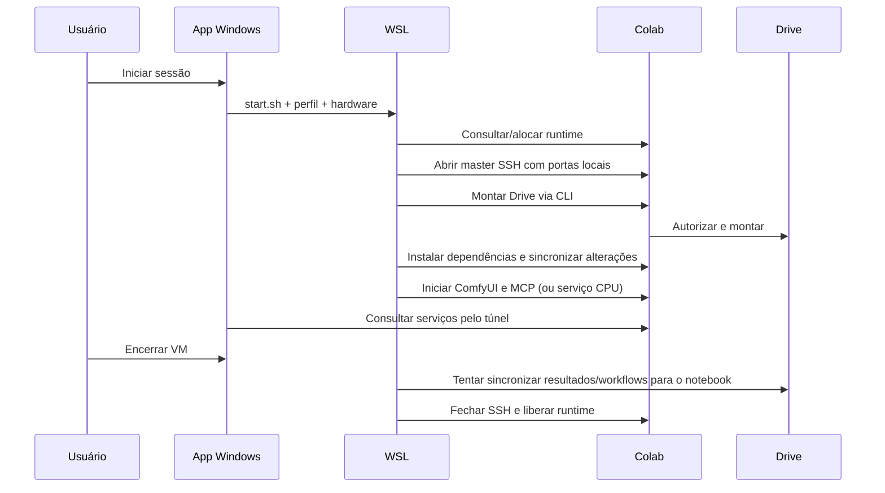

# Arquitetura

## Processos e responsabilidades

O aplicativo possui três ambientes com responsabilidades distintas:

1. **Windows:** interface CustomTkinter, armazenamento de perfis/preferências, criptografia DPAPI, polling de métricas e execução de subprocessos WSL.
2. **WSL:** Colab CLI, autorização por perfil, chave SSH e scripts de orquestração. Um master OpenSSH mantém o transporte; comandos, SCP, rsync e encaminhamentos compartilham a conexão.
3. **Colab:** instalação Easy Install/ComfyUI, CUDA fornecido pelo runtime, serviço de downloads, Comfy MCP e montagem do Drive.

`Dashboard` combina `Shell` (layout) e `SessionWindow` (controle de sessão). A interface usa uma fila de eventos para receber resultados dos workers. Chamadas de rede não devem acontecer no thread Tk. Atualizar o estado não deve navegar, recriar telas ou reposicionar a rolagem.

## Ciclo de vida

`start.sh` usa `flock` por perfil e um grupo próprio de processos. Cancelar o início sinaliza esse grupo. `assignment_guard.py` registra o conjunto de alocações antes do início e tenta liberar uma nova alocação identificável caso o CLI falhe antes de persistir a sessão; situações ambíguas são recusadas.

`ssh_transport.sh` é a única abertura do transporte SSH. Clientes usam `ControlPath` e `ProxyCommand=false`: perder o master não pode abrir silenciosamente outra conexão e provocar HTTP 429. A abertura inicial aceita até quatro tentativas para a liberação atrasada de uma conexão anterior.

## Armazenamento

| Caminho | Proprietário / finalidade |
| --- | --- |
| `%LOCALAPPDATA%/EasyComfyColab/runtime.json` | Distribuição e usuário WSL escolhidos neste computador |
| `%LOCALAPPDATA%/EasyComfyColab/profiles.json` | Identificadores de perfis e e-mails autorizados |
| `%LOCALAPPDATA%/EasyComfyColab/model-credentials.json` | Tokens HF/Civitai cifrados com DPAPI |
| `%LOCALAPPDATA%/EasyComfyColab/preferences.json` | Preferências da interface |
| `%LOCALAPPDATA%/EasyComfyColab/sessions.json` | Histórico observado de operações |
| `~/.local/share/easy-comfy-colab/venv` | Ambiente privado do Colab CLI |
| `~/.local/share/easy-comfy-colab/profiles/<id>` | Token OAuth e sessões CLI isolados por perfil |
| `~/.local/share/easy-comfy-colab/drive/<id>` | Autorização adicional para a API do Drive |
| `~/.ssh/easy_comfy_colab_ed25519` | Chave SSH gerada na instalação |
| `~/.local/state/easy-comfy-colab/<id>` | PID, locks, logs, known_hosts e socket SSH |
| `/content/drive/MyDrive/ComfyColab` | Dados persistentes na conta selecionada |
| `/content/comfy-colab` | Software e processos temporários da VM |

Os caminhos WSL usam o `$HOME` do usuário configurado. Os perfis do Windows não contêm caminhos de outro computador. O perfil inicial vem desconectado; o pacote não importa dados da instalação pessoal que originou o projeto.

## Downloads

`custom_nodes/comfy_colab_remote_download/service.py` implementa as rotas aiohttp usadas pela interface e pelo adaptador JavaScript do ComfyUI. `remote/download_server.py` carrega o mesmo serviço no modo CPU sem importar PyTorch.

- A entrada valida provedor, HTTPS, nome, categoria, extensão e contenção do caminho.
- URLs com tokens nos parâmetros são recusadas. A credencial vem separada e é usada pelo worker; não entra no histórico de downloads.
- Um limite global permite 1–6 workers. A reserva por caminho impede dois downloads simultâneos do mesmo destino.
- O arquivo é escrito em `.part`; só recebe o nome final após a transferência e verificação de tamanho. ETag + If-Range permitem retomar quando suportado pela origem. Não é uma verificação criptográfica completa dos pesos.
- O estado da fila persiste em `user/comfy-colab-downloads.json` no Drive. Na próxima inicialização, trabalhos ativos antigos aparecem interrompidos; retomar é uma ação explícita.
- Cancelar é cooperativo e pode esperar a próxima leitura de rede; o parcial é preservado.

## Cópia entre Drives

O processo roda no WSL com autorizações independentes para origem e destino. Enumera a árvore, verifica espaço, concede leitura ao destino e usa `files.copy` no Google Drive. Pastas são recriadas. `appProperties` identificam origem/versão para retomada, e checksums/tamanhos disponíveis verificam a cópia. Originais não são removidos. Falhas interrompem a operação; uma nova tentativa reaproveita o que já foi verificado.

Compartilhar biblioteca concede edição a uma pasta e cria um atalho no destino; não transfere propriedade nem duplica pesos. Ainda depende da resolução do atalho pelo DriveFS e da disponibilidade da conta de origem.

## Créditos e inatividade

`SessionLedger` integra a taxa de CU/h **da conta** nos intervalos observados. Lacunas longas e valores ausentes ficam explicitamente sem estimativa. `IdleGuard` exige métricas com menos de 20 segundos, fila vazia, downloads parados e ausência de operação local. Não representa um limite de gastos garantido nem funciona com o aplicativo fechado.

## Limites de confiança

As portas `18188` e `18189` escutam apenas no loopback. Não há autenticação adicional do aplicativo nesses serviços locais; processos no mesmo computador podem acessá-los. Nunca transforme os túneis em serviços públicos sem projetar autenticação e controle de acesso próprios.

Custom nodes executam código Python na VM e podem acessar o Drive montado. Instalar um node envolve confiar no seu mantenedor. O MCP também oferece controle do ambiente remoto; ferramentas e clientes conectados precisam ser confiáveis.

## Destino de outputs (2.0.2)

`Profile.output_mode` persiste a preferência por conta; `remote/output_storage.py` escolhe o diretório usado tanto por `run.sh` quanto por `restart.py`. No modo PC, o caminho usa um identificador único por VM em `/content/comfy-colab/output-pc/`, separado do Drive. O reinício apenas do servidor aplica mudanças em sessões existentes.

`app/output_control.sh` reutiliza o master SSH para cópias rsync e reinício. A interface agenda cópias sem bloquear a thread gráfica. `stop.sh` copia workflows, pausa o servidor ocioso, aguarda o lock de cópia e exige checksum na cópia final de outputs temporários. Só então encerra a VM. Falhas mantêm a VM e acionam uma tentativa de SIGCONT. O desligamento externo e a expiração da VM não passam por essa proteção.

`Profile.media_data` aponta para `Comfy Colab Results` na pasta do usuário Windows; `COMFY_MEDIA_ROOT` é convertido por `wslpath`. Workflows locais permanecem no diretório anterior. Contas adicionais usam subpastas próprias. O atalho antigo e outputs anteriores não são migrados automaticamente.
